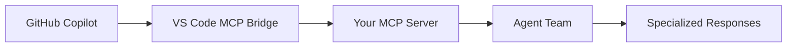

# MCP Integration Setup for GitHub Copilot

## Overview
This document explains how to configure GitHub Copilot to work with your MakhoolDesigns AI Agent Team through the Model Context Protocol (MCP).

## Configuration Steps

### 1. VS Code Settings Configuration
The `.vscode/settings.json` file has been configured to:
- Register your MCP server with VS Code
- Enable MCP support in GitHub Copilot
- Specify the command to start your agent team

### 2. How GitHub Copilot Discovers Your Agents



**Process:**
1. **VS Code reads** `.vscode/settings.json` on workspace load
2. **MCP Bridge** starts your server when Copilot needs enhanced capabilities  
3. **Your MCP Server** exposes 6 specialized agents as tools
4. **GitHub Copilot** can call these tools for complex development tasks

### 3. Server Lifecycle Management

**Automatic Startup:**
- VS Code starts your MCP server when Copilot needs it
- Server runs in background using stdio transport
- No manual startup required once configured

**Manual Startup (for testing):**
```bash
# Test your MCP server manually
cd packages/ai-agents
npm run start-server
```

### 4. Available Tools for GitHub Copilot

Your agent team exposes these tools to Copilot:

#### **assign_task**
Route tasks to the most appropriate agent based on capabilities.

#### **coordinate_agents** 
Coordinate multiple agents for complex multi-disciplinary tasks.

#### **get_agent_info**
Get information about available agents and their specializations.

#### **plan_feature**
Use Project Manager Agent for comprehensive feature planning.

#### **review_code**
Perform specialized code reviews (security, accessibility, performance).

#### **get_project_context**
Provide project-specific context about your Rush.js monorepo.

### 5. How Copilot Uses Your Agents

**Scenario: Complex Request**
```
User: "Create a complete user authentication system with JWT"

GitHub Copilot process:
1. Recognizes this as a complex, multi-domain task
2. Calls `plan_feature` tool via your MCP server
3. Project Manager Agent breaks down the feature
4. Calls `assign_task` for each sub-task:
   - Backend Agent: JWT implementation, security
   - Frontend Agent: Login components, state management  
   - QA Agent: Security review, validation
   - Testing Agent: Auth flow tests
5. Returns comprehensive implementation plan
```

### 6. Verification Steps

**Check if MCP is working:**
1. Open VS Code in your workspace
2. Look for MCP server status in VS Code output panel
3. Try a complex request with GitHub Copilot
4. Check if Copilot mentions using "specialized agents" or "development team"

**Debug MCP Connection:**
```bash
# Check if server builds correctly
cd packages/ai-agents
npm run build

# Test server startup
npm run start-server
```

### 7. Environment Requirements

**Required API Keys:**
- `OPENAI_API_KEY` - For GPT-4 powered agents
- `ANTHROPIC_API_KEY` - For Claude powered agents (optional)

**VS Code Extensions:**
- GitHub Copilot (latest version with MCP support)
- GitHub Copilot Chat

### 8. Troubleshooting

**Common Issues:**

1. **"MCP server not found"**
   - Check `.vscode/settings.json` path is correct
   - Ensure `packages/ai-agents/dist/mcp-server.js` exists
   - Run `npm run build` in ai-agents package

2. **"Agent tools not available"**  
   - Verify API keys in `.env` file
   - Check server logs for startup errors
   - Restart VS Code to reload MCP configuration

3. **"Copilot not using agents"**
   - Update GitHub Copilot extension to latest version
   - Enable MCP support in Copilot settings
   - Try more complex requests that require specialized knowledge

### 9. Expected Behavior

**When working correctly, you'll notice:**
- Copilot responses include domain-specific expertise
- Complex requests get broken down systematically  
- Code suggestions follow your project patterns
- Multi-agent coordination for cross-cutting concerns
- Enhanced context awareness of your monorepo structure

**Example interactions:**
- "Create a dashboard" → UI/UX + Frontend + Backend agents coordinate
- "Add file uploads" → Security review + API design + UI components
- "Optimize performance" → QA analysis + Frontend optimization + Backend caching

## Next Steps

1. **Configure API keys** in `packages/ai-agents/.env`
2. **Restart VS Code** to load MCP configuration
3. **Test with complex requests** to verify agent integration
4. **Monitor VS Code output** for MCP server status and logs
